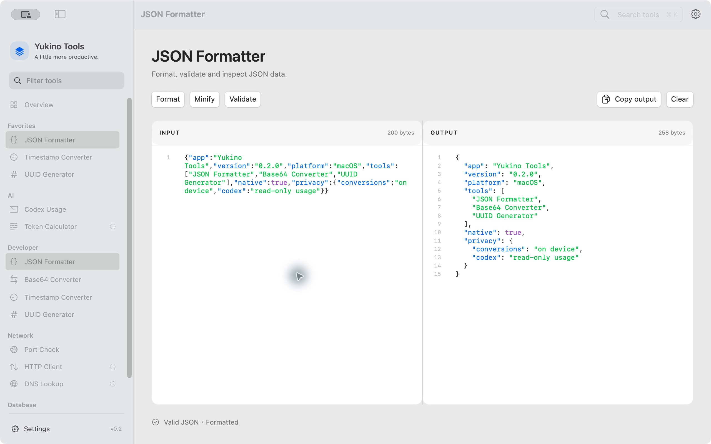
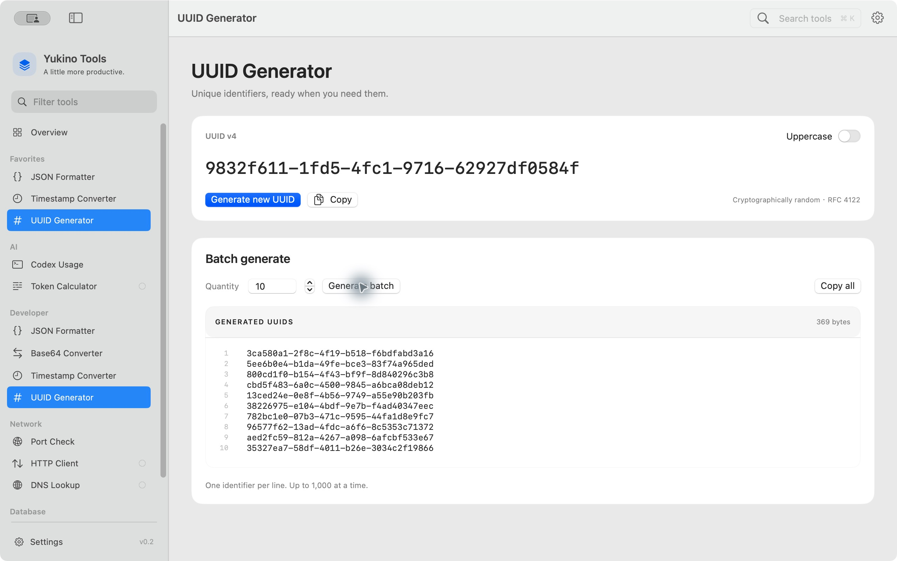

<div align="center">

# Yukino Tools

**A little more productive.**

一个安静、轻量的原生 macOS 开发工具箱。日常转换、网络检测和 Codex 用量，放在同一个工作空间。

[](https://github.com/Yukino-7/Yukino-Tools/releases)
[](Package.swift)
[](https://github.com/Yukino-7/Yukino-Tools/releases/latest)
[](LICENSE)

[下载安装](https://github.com/Yukino-7/Yukino-Tools/releases/latest) · [功能](#功能) · [源码构建](#源码构建) · [更新记录](CHANGELOG.md) · [反馈问题](https://github.com/Yukino-7/Yukino-Tools/issues)

</div>



## 功能

SwiftUI + AppKit + Swift Charts，使用原生窗口、控件、文本编辑器与系统字体。无 WebView，无第三方包依赖。

| 工具 | 当前支持 |
| --- | --- |
| **Codex Usage** | 真实账户额度、重置时间、本机 Token 统计、缓存率、上下文估算、会话详情、Today / 7 days / 30 days 图表 |
| **JSON Formatter** | 格式化、压缩、校验、行号、语法高亮、双栏编辑、查找与复制；保留数字精度、键顺序和转义文本 |
| **Base64 Converter** | UTF-8 编码、解码、交换与复制 |
| **Timestamp Converter** | 实时当前时间戳、秒/毫秒、日期双向转换、Local / UTC |
| **UUID Generator** | 随机 UUID v4、大小写切换、批量生成，单次最多 1,000 个 |
| **Port Check** | Network.framework 真实 TCP 探测、超时、连接耗时及最近端点记录 |

工具箱还支持分组侧栏、搜索、收藏与拖动排序、最近使用记录、窗口位置记忆、菜单栏入口、系统/浅色/深色外观及登录启动设置。

**待实现：** Token Calculator、HTTP Client、DNS Lookup、PostgreSQL、Redis。目前保留导航入口，页面会标明尚未实现。

### UUID 批量生成



截图来自实际运行的原生应用，JSON 内容和 UUID 为公开展示示例。

## 下载安装

在 [Releases](https://github.com/Yukino-7/Yukino-Tools/releases/latest) 下载最新版本。

| 安装包 | 用法 |
| --- | --- |
| `Yukino-Tools-0.2.0-macos-arm64.dmg` | 打开 DMG，将 **Yukino Tools.app** 拖到 **Applications** |
| `Yukino-Tools-0.2.0-macos-arm64.zip` | 解压后，将应用移动到 **Applications** |
| `SHA256SUMS.txt` | 安装包的 SHA-256 校验值 |

首个公开版本为 **v0.2.0**。要求 **macOS 14+**，预编译包适用于 **Apple Silicon（M 系列芯片）**。Intel Mac 可使用源码在本机编译，首版尚未提供经过验证的 Intel 二进制。

当前发布包使用本机 **ad hoc 签名**，尚未经过 Apple Developer ID 签名和公证。首次打开下载的应用时，macOS 可能阻止运行；确认下载来源后，可按系统提示在“系统设置 → 隐私与安全性”中选择“仍要打开”。

将校验文件与下载包放到同一目录后，可执行：

```sh
shasum -a 256 -c SHA256SUMS.txt
```

## Codex 真实数据

首页、Codex 面板与菜单栏共用真实数据服务。

- **账户额度**：调用已安装 Codex CLI 的 `app-server`，通过只读的 `account/rateLimits/read` 获取当前 ChatGPT 账户的已用比例、窗口周期和重置时间。优先采用 `rateLimitsByLimitId.codex`；不启动模型任务，不直接读取或展示登录凭据。详见 [Codex App Server 文档](https://learn.chatgpt.com/docs/app-server)。
- **本机会话与 Token**：增量读取 `~/.codex/sessions` 和 `archived_sessions` 的 JSONL 元数据及用量计数，合并同一会话的分页文件，按 response ID 去重，并兼容旧版累计计数。统计服务不保存或展示对话正文。
- **统计口径**：总 Token = input + output；缓存输入和推理输出为其子集，不重复相加。缓存率 = cached input / input。上下文 = 最近请求的 Token / 日志中的模型窗口，是估算值。
- **刷新**：默认每 60 秒刷新，支持手动刷新。在 **Settings → Codex** 中选择数据目录、CLI 或 15–300 秒刷新间隔。账户读取失败时显示错误及上次记录时间；缺失值显示 `—`，过期额度不会自动归零。

账户额度反映当前登录账户；Token 图表仅覆盖**本机保留的日志**，不等于账户所有设备和云端的完整 Token 统计。图表按本机时区聚合。

支持自动检测 ChatGPT / Codex 应用及常用 CLI 安装路径，复用 Codex 现有登录状态。自定义日志目录只改变本机统计来源；账户额度仍来自 CLI 当前登录账户。CLI 未安装、未登录或网络不可用时，界面会显示提示。

## 快捷键

| 快捷键 | 操作 |
| --- | --- |
| `⌘K` | 打开工具搜索；方向键选择、回车打开、Esc 关闭 |
| `⌘1` | Overview |
| `⌘2` | Codex Usage |
| `⌘F` | 编辑器内查找；其他页面打开工具搜索 |
| `⌘R` | 格式化 JSON |
| `⌘,` | 设置 |

## 源码构建

需要 **macOS 14+** 和 **Swift 6.0+**。仅安装 Apple Command Line Tools 即可使用脚本构建，无需下载第三方依赖。

```sh
git clone https://github.com/Yukino-7/Yukino-Tools.git
cd Yukino-Tools
./scripts/build-app.sh
open "build/Yukino Tools.app"
```

默认构建 Release；开发时使用 `./scripts/build-app.sh debug`。脚本使用项目内编译缓存、自动组装 `.app` 并执行 ad hoc 签名。默认构建当前机器架构。

### Xcode

打开 `YukinoTools.xcodeproj`，选择 **YukinoTools** scheme 和 **My Mac**，然后 Build & Run。要求 Xcode 16+；工程通过同目录 Swift Package 引用 `YukinoCore`，无远程依赖，也不需要开发者账户。

新增或移动源文件后可重新生成工程：

```sh
python3 scripts/generate-xcode-project.py
```

当前版本已验证 SwiftPM 编译、测试和 `.app` 实机运行，Xcode 工程通过 plist 结构检查；尚未在完整 Xcode 中执行 Build & Run。

### 发布打包

```sh
./scripts/package-release.sh
```

生成当前架构的 ZIP、DMG 和 `SHA256SUMS.txt`，输出目录为 `build/releases/v<version>/`。应用包包含 MIT 许可证。

## 验证

```sh
./scripts/test.sh
```

17 项 Swift Testing 测试覆盖转换工具、端口校验与本机 TCP 开放/关闭端口，以及 Codex 累计计数、缓存口径、重复响应、分页合并、分叉历史、缺失额度、增量/截断/归档日志、只读 RPC 协议及超时。

TCP 集成测试会临时创建回环监听，在限制网络的沙箱中运行需允许本地网络操作。原生界面已检查工具导航、文本编辑器、命令搜索、UUID 批量生成、真实 Codex 数据与刷新。登录启动需系统支持，未在测试中注册。

## 项目结构

```text
Sources/
  YukinoCore/            # 转换、TCP、Codex 日志与账户服务
  YukinoTools/
    App/                 # 入口、窗口、侧栏、快捷键
    Core/                # 工具目录、状态、组件、编辑器、用量刷新
    Features/            # Dashboard、工具、搜索、设置、菜单栏
Tests/YukinoCoreTests/    # 服务测试
docs/images/             # README 原生界面截图
Resources/               # Info.plist、原生图标
scripts/                 # 构建、测试、发布、工程及图标生成
```

## 许可与致谢

[MIT License](LICENSE) © 2026 Yukino。

视觉参考：[Project Management Dashboard](https://dribbble.com/shots/14038313-Project-Management-Dashboard-UX-UI-Design)。结合 macOS 原生控件与键盘体验实现。
